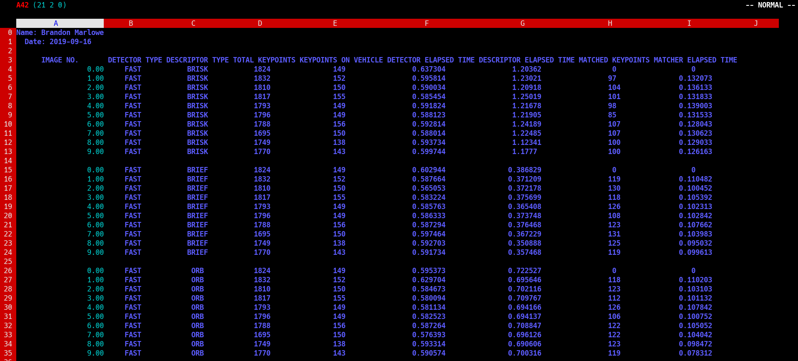

# MP.1 Data Buffer Optimization

In order to retain the ring buffer of size `dataBufferSize`, an `if` condition is used on line 140
of `MidTermProject_Camera_Student.cpp`. The `if` condition checks to see if the `dataBuffer` is
equal to the `dataBufferSize`, and if so, the front of the vector is removed using the `erase`
method, and the next frame is pushed to the back.

```cpp
if (dataBuffer.size() == dataBufferSize) { dataBuffer.erase(std::begin(dataBuffer)); }

dataBuffer.push_back(frame);
```

# MP.2 Keypoint Detection

Within an `if`, `else if`, and `else` conditions, the `Shi-Tomasi`, `Harris`, `ORB`, `FAST`,
`BRISK`, `AKAZE`, and `SIFT` detectors are executed. On line 160 of
`MidTermProject_Camera_Student.cpp`, the `detectorType` is compared against the string of `HARRIS`,
and if the strings are equal, the `detKeypointsHarris` function is called. Otherwise, the
`detKeypointsModern` function is executed, which contains a series of `if` conditions that compare
the `detectorType` string against other string literals.

Within `detKeypointsModern`, a `cv::Ptr` of `FeatureDetector` type is assigned the proper detector
based on the chosen detector. Once assigned, the `detector->detect` method is executed, which takes
the grayscale image as input, and stores the detected keypoints in the `keypoints` vector. The
results are displayed if the user has chosen to visualize them.

The number of keypoints detected and the elapsed time is returned in a struct, which is used to
populate a vector, and in-turn fill out the final CSV file. This pattern is repeated with all
function calls in the `matching2D_Student.cpp` file.

# MP.3 Keypoint Removal

The keypoints found within the bounding box of the preceding vehicle are extracted within the `if`
condition on line 177 of `MidTermProject_Camera_Student.cpp`. An auxilary vector named
`retainedPoints` is used to store all the points found within the bounding box named `vehicleRect`.
For each point in the `keypoints` vector, the `vehicleRect.contains` method is called to determine
if that point exists within the boundary. If the condition is true, that point is copied to the
`retainedPoints` vector. When the for-loop finishes, the `keypoints` vector is assigned the contents
of the `retainedPoints` vector.

# MP.4 Keypoint Descriptors

The `BRIEF, ORB, FREAK, AKAZE`, and `SIFT` descriptors were implemented in a manner similar to the
detectors from `MP.2`. Beginning on line 57 of `matching2D_Student.cpp`, a series of `if` conditions
are used to compare the string input by the user. If the string matches one of the hard-coded
descriptor types, the generic `extractor` variable is assigned the appropriate descriptor, and the
`compute` method is called. Additionally, the elapsed time is measured during execution.

# MP.5 Descriptor Matching

`FLANN` matching was implemented on line 21 of `matching2D_Student.cpp`. The `matcher cv:Ptr` of
`cv::DescriptorMatcher` type is assigned a pointer to a descriptor matcher constructed with a
`FLANNBASED` type. Additionally, two `if` conditions are used to determine if the descriptor
matrices are not `CV_32F` type, and if so, they are converted in order to avoid an existing bug in
OpenCV.

# MP.6 Descriptor Distance Ratio

K-Nearest-Neighbor selection is implemented in `matching2D_Student.cpp` beginning on line 34. A 2D
vector of `cv::DMatch` type is used to store the matches from calling `matcher->knnMatch`, using a
value of 2 for `k`. Next, for each match in the `knnMatches` vector, the descriptor distance ratio
test is performed. The distance threshold is set to 0.8, and each point falling within the threshold
distance is copied to the `matches` vector.

# MP.7 Performance Evaluation 1

The number of keypoints on the preceding vehicle are recorded within the `if` condition beginning on
line 177. This task is accomplished as side-effect of task `MP.3`, where the number of keypoints found on
the preceding vehicle is equal to the size of `retainedPoints` vector. The results are stored in the
output CSV file.

# MP.8 Performance Evaluation 2

The number of matched keypoints are determined in the `matchDescriptors` function in
`matching2D_Student.cpp`. This is again accomplished as a side-effect of task `MP.6`, and the number
of matched points is equal to the size of the `matches` vector. The results are stored in the output
CSV file.

# MP.9 Performance Evaluation 3

The final results can be found in the CSV file named `Brandon_Marlowe_Midterm_Project.csv` within
the `report` directory. Based on the final results, the top 3 detector/descriptor combinations for
this project are:

1. `Detector`: FAST, `Descriptor`: BRIEF

2. `Detector`: FAST, `Descriptor`: ORB

3. `Detector`: FAST, `Descriptor`: BRISK

The `FAST` detector in combination with the `BRIEF`, `ORB`, and `BRISK` descriptors executed in the
shortest amount of time. Additionaly, they were able to maintain a good portion of points on the
preceding vehicle, and match a good portion of points between successive images. These three
combinations retained much of the detail required to detect and track vehicles on the road. Reaction
time for autonomous vehicles is extremely critical, thus having a performant dectector and
descriptor combination is of utmost importance.

The BRISK detector was able to detect more initial points, and retain more points on the preceding
vehicle, but with significantly slower execution time. In general, all other detector/descriptor
combinations either executed more slowly and produced a similiar number of keypoints, or produced a
larger number of keypoints, but with an even extremely slow execution time.

Note: The execution times shown in this screenshot are from running the program on my desktop
computer. The timing data may vary when running in the student workspace.


